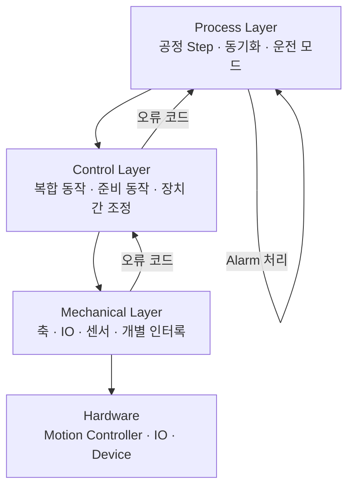

---
tags:
  - Architecture
  - Automation
  - Motion
---

# Mechanical · Control · Process 3계층 분리

자동화 장비 소프트웨어에서 Mechanical과 Process 사이에 Control 계층을 두면, 공정 순서와 개별 장치 제어를 분리할 수 있다. 이 문서는 모션, 실린더, 진공 및 센서가 함께 동작하는 설비를 기준으로 각 계층의 책임과 알람 경계를 정리한다.

## 계층별 책임



| 계층 | 주 책임 | 적합한 API 예 |
| --- | --- | --- |
| Mechanical | 축 이동, IO 출력, 센서 읽기, 원점 확인, 개별 장치 안전 인터록 | `SafeMove`, `OpenGripper`, `IsVacuumOn` |
| Control | 여러 Mechanical 동작의 순서화, 준비 상태 구성, 단위 동작의 결과 반환 | `PrepareForFeed`, `FeedMaterial`, `PrepareForPress`, `Peel` |
| Process | 공정 Step 전이, 다른 공정과의 동기화, 운전 모드·재시도 정책, Alarm 승격 | `FeedReady → Feed → PressReady → Press → Peel` |

Mechanical은 장치의 물리 동작을 알고, Control은 여러 물리 동작을 공정 의미가 있는 하나의 명령으로 조합한다. Process는 그 명령을 언제 실행할지 결정하며, 축·IO 주소나 그리퍼 제어 순서를 직접 알아서는 안 된다.

## Control 계층을 두는 이유

Process가 Mechanical을 직접 호출하면 공정 코드에 다음 지식이 섞인다.

- 장치별 안전 위치와 축 이동 순서
- 그리퍼·진공·실린더의 선후 조건
- 센서 확인 및 실패 시 정지 처리
- 장치 구현 또는 하드웨어 변경에 따른 세부 수정

Control 계층은 이를 `FeedMaterial()`처럼 의미 있는 API로 감싼다. 그 결과 Process는 공정 전이와 설비 간 동기화에 집중하고, 장치 동작 순서의 변경은 Control에 국한된다.

이는 일반적인 아키텍처 평가에서 다음 항목에 유리하다.

- **결합도 감소**: Process가 구체 장치 API 대신 Control 계약에 의존한다.
- **응집도 향상**: 하나의 복합 동작에 필요한 준비·인터록·실행이 한곳에 모인다.
- **변경 영향 축소**: 장치 교체, 안전 순서 조정, 모션 파라미터 변경의 Process 전파를 줄인다.
- **재사용성 향상**: Manual, Auto, Recovery 등의 호출자가 동일한 Control 명령을 재사용할 수 있다.

단, Control이 Mechanical 메서드를 그대로 다시 노출하는 단순 전달 계층이면 이점이 작다. 반드시 복수의 Mechanical 동작을 조합하거나 공통 제어 정책을 캡슐화해야 한다.

## 알람 처리 경계

권장 흐름은 다음과 같다.

1. Mechanical은 실패 원인을 오류 코드로 반환하고 필요 시 진단 로그를 남긴다.
2. Control은 하위 오류 코드를 호출자에게 그대로 반환하거나, 복합 동작 문맥에 맞는 오류 코드로 변환한다.
3. Process는 오류를 Alarm으로 승격한다.
4. 공정 관리자 또는 Alarm 관리자는 장비 정지, 중복 Alarm 억제, 표시, 이력 저장, 복구 상태 전환을 수행한다.

이렇게 하면 저수준 장치 객체가 UI나 전체 설비 정지 정책을 알 필요가 없다. 또한 Alarm 표시 정책을 한 곳에서 관리할 수 있다.

## Process가 가져도 되는 로직

Process가 단순히 Control 함수를 나열하기만 하는 것은 아니다. 다음은 Process에 남겨야 한다.

- Step 상태 전이와 다음 단계 결정
- 다른 공정과의 시작·완료 핸드셰이크
- Auto, Test, Dry-run 등 운전 모드 분기
- Vision 검사, 작업 수량, 재시도 및 운영자 확인 같은 공정 정책
- Control 반환 오류의 Alarm 승격

반대로 안전 위치 이동, 모션 파라미터 계산, 그리퍼/진공의 세부 순서 같은 장치 동작은 Control 또는 Mechanical에 둔다.

## 모션 포함 권장 패턴: 공급 동작

다음은 계층 분리가 잘 된 대표 흐름이다.

```text
Process:  공급 준비 Step
  -> Control: PrepareForFeed()
       -> Mechanical: 상태 확인, 장치 상승, 그리퍼 정리, 안전 위치 이동

Process:  공급 Step
  -> Control: FeedMaterial()
       -> Mechanical: 그리퍼 제어, 목표 위치 이동
            -> Motion: 원점·위치 ID·상대 장치 인터록 확인 후 StartMove / WaitDone

실패: Mechanical/Control 오류 코드 반환
  -> Process: Alarm Manager에 전달
```

여기서 Mechanical의 `SafeMove`는 위치 ID 검증, 원점 확인, 장치 간 최소 인터록과 실제 축 제어를 담당한다. Control의 `FeedMaterial`은 공급에 필요한 여러 개별 동작을 조합하고, Process는 공급 시점과 다음 공정의 동기화만 관리한다.

## 점검 기준

다음 항목이 발견되면 분리 품질을 점검한다.

- Process가 축 이동·IO 출력·장치의 공개 데이터에 직접 접근한다.
- Control API가 하위 Mechanical 메서드 이름과 일대일로 대응하며 조합 책임이 없다.
- Mechanical이 Alarm UI, 설비 전체 정지 또는 공정 Step을 직접 변경한다.
- 한 장치의 이동 안전 조건이 여러 Process에 중복 구현되어 있다.

Process의 직접 `SafeMove` 호출은 `MoveToSafety()` 같은 Control API로 이동하고, 공개 데이터 직접 참조는 조회 API로 감싸는 것이 일반적인 개선 방향이다.

## 주의사항

- Mechanical 내부의 최소 안전 인터록은 Control로 올리지 않는다. 어떤 호출 경로에서도 축 충돌을 방지해야 하기 때문이다.
- Control의 복합 동작은 성공·실패의 원자성, 중간 실패 시 안전 상태, 재호출 가능성을 명확히 정의한다.
- Alarm 코드에는 발생 계층과 원인이 추적 가능하도록 공통 규칙을 적용한다.
- 실제 설비의 안전 기능은 소프트웨어 구조와 별개로 안전 PLC, 하드웨어 인터록 및 현장 안전 절차를 우선한다.
