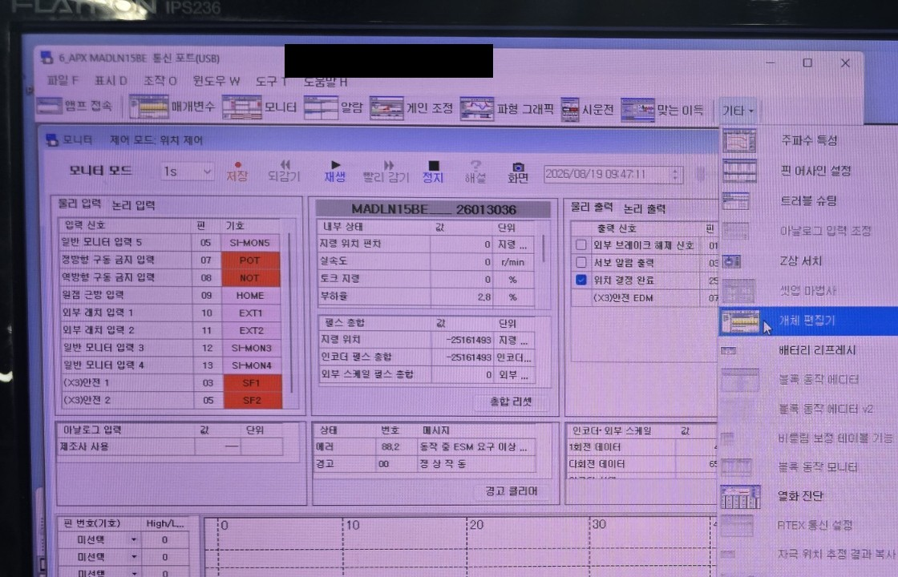
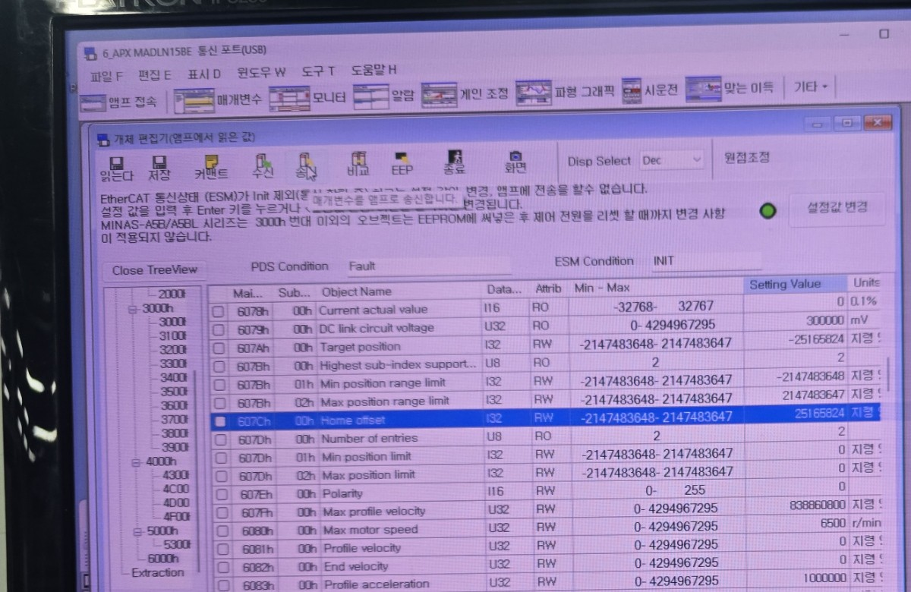
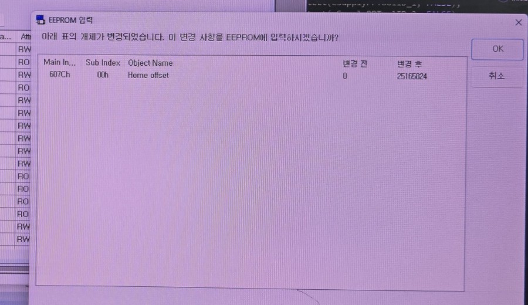

---
tags:
  - Automation
  - Motion
  - Panasonic
  - MINAS
  - A6B
  - Servo
  - Absolute Encoder
  - Home Offset
---

# Panasonic MINAS A6B Absolute Home Offset 설정

## 개요

Panasonic MINAS A6B Absolute System에서 기계가 기준 위치에 있을 때, 앱솔루트(절대치) 엔코더 값을 초기화하지 않고 **Home Offset**을 변경하는 촬영 절차를 정리한다. 이 작업은 엔코더 좌표에 대한 원점 오프셋을 수정하는 것이며, Absolute Encoder 초기화, battery 초기화, multi-turn data clear, Alarm clear 또는 Origin return과는 구분해야 한다.

## 적용 대상

- Panasonic MINAS A6B
- Absolute Encoder System
- 촬영 화면에 표시된 Panasonic 설정 소프트웨어(정확한 소프트웨어 버전은 확인하지 않음)

## Home Offset의 동작 원리

### 공식 사양

Panasonic의 A6B EtherCAT Communication Specification은 `607Ch:00h`를 `Home offset`으로 정의한다. 단위는 command, 범위는 `-2147483648`부터 `2147483647`, 형식은 `I32`, Access는 `rw`이며, RxPDO로 사용할 수 있고 모든 operation mode에서 지원된다. 표의 EEPROM 열은 `Yes`이므로 백업 지원 객체다. 기본값은 해당 표에 별도로 제시되지 않는다. [SX-DSV03242 R15.0, §6-9-4, pp. 273–274](https://mediap.industry.panasonic.eu/assets/custom-upload/Factory%20%26%20Automation/Industrial%20Motors/Manuals/mn_minas_a6b_ethercat_communication_specification_pid_en.pdf)

위 사양은 일반적인 위치 초기화(홈 검출이 아닌 경우), 전자기어 역변환 값이 1:1이고 `607Eh Polarity`가 반전되지 않았을 때 다음을 제시한다.

```text
6062h Position demand value
= 6064h Position actual value
= 6063h Position actual internal value + 607Ch Home offset
```

Absolute System의 semi-closed control에서도 Panasonic은 `6064h = (6063h × electronic-gear reverse conversion value) + 607Ch`를 명시한다. Polarity가 반전되면 내부 위치 항의 부호가 바뀌지만 Home offset은 계속 가산된다. 따라서 **다른 조건이 같을 때 Home offset을 +Δ만큼 변경하면 6064h 표시값도 +Δ만큼 이동**한다. [SX-DSV03242 R15.0, §6-9-4, p. 274](https://mediap.industry.panasonic.eu/assets/custom-upload/Factory%20%26%20Automation/Industrial%20Motors/Manuals/mn_minas_a6b_ethercat_communication_specification_pid_en.pdf)

### 현장 확인

촬영 화면에서도 `607Ch:00h`가 `I32`, `RW`로 보이며 `0 → 25165824` 변경과 EEPROM 입력 확인이 보인다. 사진에 남은 위치 값만으로는 변경 전후를 같은 물리 위치에서 비교했다는 것을 확정할 수 없어, 이 예시 숫자로 부호를 재검증하지는 않는다.

## Offset 계산

축이 정지해 있고 전자기어·Polarity 등 다른 좌표 변환 조건을 바꾸지 않는다는 전제에서 다음처럼 계산한다.

```text
CurrentPosition = 현재 6064h 표시 좌표
TargetPosition  = 원하는 6064h 표시 좌표
CurrentOffset   = 현재 607Ch 값

NewOffset = CurrentOffset + (TargetPosition - CurrentPosition)
```

예를 들어 현재 표시 좌표가 `A`, 원하는 좌표가 `B`, 현재 Offset이 `C`이면 새 Offset은 `C + (B - A)`다. 이 식은 offset이 위치 표시값에 가산된다는 Panasonic A6B 공식식에서 나온다. 전자기어비·Polarity·full-closed control을 함께 바꾸는 작업에는 이 단순식을 적용하지 않는다.

!!! warning "주의"
    `607Ch` 변경은 같은 물리 위치의 표시 좌표를 즉시 또는 지정된 반영 시점에 이동시킬 수 있다. 이동 명령, 범위 제한, PLC 좌표 데이터 및 안전 인터록을 함께 점검한 뒤 수행한다.

## 빠른 작업 요약

통신 상태 확인 및 정지
→ `기타` 메뉴의 `객체 편집기`
→ `앰프에서 읽어오기`
→ `607Ch:00h / Home offset` 수정
→ `EEPROM 입력` 확인
→ 설정값과 위치 표시 확인

!!! warning "주의"
    Home Offset 변경은 기계 좌표계의 해석에 영향을 줄 수 있다. 축을 의도한 기준 위치로 이동시키고, 현재 표시값과 입력값을 기록한 뒤 수행한다. 촬영 절차만으로 Servo OFF 필요 여부나 전원 재인가 필요 여부는 확정할 수 없다.

## 사전 조건

- PC와 Servo amplifier가 연결되어 있고, 설정 프로그램의 통신 화면에서 대상 앰프 상태를 확인할 수 있어야 한다.
- Absolute System 및 엔코더 배터리 상태가 정상인지 사전에 확인한다.
- 축을 원하는 기계 기준 위치에 이동시킨다.
- 촬영 순서에는 `Stop All` 확인 대화상자가 보이며, 이후 객체 편집기 화면은 `ESM Condition: INIT`으로 표시된다. 실제 장비에서 요구되는 정지·상태 전이 조건은 해당 장비의 매뉴얼과 안전 절차를 함께 확인한다.

## 설정 절차

### 1. 대상 앰프 상태와 현재 위치를 확인한다

설정 프로그램의 모니터 화면에서 대상 앰프와 위치·엔코더 관련 표시를 확인한다. 이 단계에서 현재 기계 위치가 원하는 기준 위치인지 먼저 판단한다.

### 2. `기타` → `객체 편집기`를 연다

촬영 화면에서는 상단 `기타` 메뉴를 열고 `객체 편집기`를 선택한다. 메뉴에는 battery refresh나 multi-turn 관련 항목도 함께 보이지만, 이 절차에서 선택한 항목은 `객체 편집기`다.



### 3. `앰프에서 읽어오기`로 현재 설정값을 읽는다

`읽어올 개체번호 선택` 대화상자에서 `앰프에서 읽어오기`를 선택하고 `OK`를 누른 뒤 객체 편집기를 연다. 파일 또는 표준 출하 설정값이 아니라 앰프의 현재 값을 읽는 선택지다.

### 4. `607Ch:00h`의 `Home offset`을 찾는다

객체 편집기에서 `607Ch`, Sub Index `00h`, Object Name `Home offset` 행을 선택한다. 촬영 화면에서 이 항목은 `I32`, `RW`로 표시된다. 표시 형식은 `Disp Select`에서 확인할 수 있으며 촬영 시점에는 `Dec`가 선택되어 있다.



### 5. `Setting Value`를 변경한다

`Setting Value`에 목표 좌표계에 맞는 Home Offset을 입력한다. 촬영 예에서는 기존 값 `0`이 `25165824`로 변경된 것이 확인되지만, 이 값은 해당 촬영 조건의 예시일 뿐 다른 축에 그대로 사용하면 안 된다.

이미지에는 입력 후 Enter 또는 `설정값 변경`으로 변경한다는 안내가 보인다. 현재 위치, 목표 표시 위치, 기존 Offset 사이의 부호 관계는 촬영 자료만으로 일반화하지 않는다. 별도 시험으로 계산 결과를 확인한 뒤 적용한다.

### 6. `EEPROM 입력` 대화상자에서 변경 내용을 확인한다

도구 모음의 `EEP`를 실행하면 `EEPROM 입력` 확인 대화상자가 열린다. 이 대화상자에서 Main Index `607Ch`, Sub Index `00h`, Object Name `Home offset` 및 변경 전·후 값을 검토하고, 의도한 값일 때만 `OK`를 선택한다.



## 설정 결과 확인

EEPROM 입력 후 다시 모니터와 객체 편집기에서 `Home offset` 및 위치 표시를 확인한다.

## 적용 시점 및 EEPROM

`1010h:01h`에 `save`를 전송하는 것이 A6B의 EEPROM 저장 절차이며, PANATERM의 객체 편집기 백업도 이 사양의 객체 백업 절차를 따른다. A6B Functional Specification은 A5B와 달리 객체 편집기로 설정·백업한 값이 실제 객체에 반영된다고 설명한다. [SX-DSV03242 R15.0, §5-6, p. 76](https://mediap.industry.panasonic.eu/assets/custom-upload/Factory%20%26%20Automation/Industrial%20Motors/Manuals/mn_minas_a6b_ethercat_communication_specification_pid_en.pdf), [SX-DSV03241 R10.0, p. 49](https://mediap.industry.panasonic.eu/assets/download-files/import/mn_minas_a6b_ethercat_functional_specification_pidsx_en.pdf)

그러나 `607Ch`의 위치 정보 반영 시점은 별도로 정해져 있다. 공식 사양은 전원 ON, EtherCAT `Init → PreOP` 통신 확립, 원점 복귀 완료, absolute multi-turn clear, 일부 PANATERM 작업 완료 등에서 그 값을 위치 정보에 더한다고 명시한다. 즉 EEPROM 저장만으로 즉시 반영된다고 가정하지 말고, 이 중 해당 시스템에 맞는 반영 시점을 제어 절차로 수행한 뒤 `6064h`를 검증한다. Control power를 반드시 다시 켜야 한다는 A6B 요구사항은 아니다.

## Servo / EtherCAT 상태 조건

`607Ch` 사양은 **updating is always possible**라고 기술하며 Servo OFF를 필수 조건으로 규정하지 않는다. 촬영 당시 `Stop All` 및 `ESM INIT`은 현장 작업 순서다. 다만 A6B 사양은 PDS가 Operation enabled인 상태에서 다른 ESM state로 전환하면 `Err88.2`가 발생할 수 있다고 설명하므로, 운전 중인 축의 상태를 전환해서는 안 된다. [SX-DSV03242 R15.0, §3-2, pp. 25–27 및 §6-9-4, p. 273](https://mediap.industry.panasonic.eu/assets/custom-upload/Factory%20%26%20Automation/Industrial%20Motors/Manuals/mn_minas_a6b_ethercat_communication_specification_pid_en.pdf)

## Home Offset과 앱솔루트 엔코더의 관계

Absolute encoder는 single-turn data와 multi-turn data를 별도로 제공하며, A6B는 이를 바탕으로 `6063h`와 `6064h` 위치 정보를 계산한다. `607Ch`는 그 계산된 위치 정보에 더해지는 좌표 offset이다. 따라서 **607Ch 쓰기 자체는 encoder 내부 multi-turn data clear 또는 battery/absolute-system 초기화가 아니다.** [SX-DSV03242 R15.0, §6-9-4, pp. 274–275](https://mediap.industry.panasonic.eu/assets/custom-upload/Factory%20%26%20Automation/Industrial%20Motors/Manuals/mn_minas_a6b_ethercat_communication_specification_pid_en.pdf)

Multi-turn clear는 별도 기능이며, A6B 사양상 absolute mode의 첫 기동에서 battery 설치 후 필요할 수 있다. `607Ch` 반영 시점 목록에는 multi-turn clear가 포함되므로, 두 작업은 서로 다른 기능이지만 clear 수행 후에는 Home offset이 좌표 계산에 다시 적용된다.

## Homing과 Home Offset의 차이

MINAS A6B는 hm(Homing) mode를 지원한다. Homing 완료 후 감지한 index-pulse 위치의 position information은 `607Ch` 값과 같게 설정된다. 또한 homing을 수행하면 위치 정보가 reset되므로 이전 좌표계로 얻은 데이터(예: touch-probe 위치)는 다시 취득해야 한다. 이는 단순히 `607Ch` 값을 편집·저장하는 현장 절차와 구별해야 한다. [SX-DSV03242 R15.0, §6-6-5 및 §6-9-4, pp. 137, 273–274](https://mediap.industry.panasonic.eu/assets/custom-upload/Factory%20%26%20Automation/Industrial%20Motors/Manuals/mn_minas_a6b_ethercat_communication_specification_pid_en.pdf)

## PANATERM으로 현재 위치를 Home으로 설정하기

PANATERM의 **Object Editor**에는 `Set Home` 기능이 있다. 이는 축을 home sensor까지 자동 이동시키는 hm(Homing) 모션이 아니라, 현재 표시 좌표를 기준으로 Home offset을 재계산하는 기능이다. PANATERM 공식 매뉴얼은 `Set Home`이 다음 계산 결과를 `607Ch:00h`에 쓰는 것으로 정의한다.

```text
New 607Ch = Current 607Ch - Current 6064h
```

공식 A6B 식 `6064h = InternalPosition + 607Ch`에 대입하면, 다음 위치 정보 반영 시점 이후 현재 물리 위치의 `6064h`가 `0`이 된다. 즉 **현재 위치를 표시 좌표 0으로 맞추기 위한 Home offset 설정**이다. [PANATERM Ver.6.0 Operation Manual Rev. 3.15, Object Editor, p. 175](https://mediap.industry.panasonic.eu/assets/download-files/import/mn_minas_a6_panaterm_operation_pidsx_en.pdf)

### 수행 절차

1. 축을 의도한 기준 위치에 안전하게 정지시킨다. PANATERM을 통한 직접 운전·설정은 기계가 움직일 수 있으므로, 충돌 영역과 인터록을 먼저 확인한다.
2. PANATERM에서 대상 A6B 드라이버와 통신을 연결한 뒤 **기타 → 객체 편집기(Object Editor)** 를 연다.
3. `Condition monitor`의 `ESM Condition`이 `INIT`인지 확인한다. PANATERM 매뉴얼은 통신 연결 상태에서 `INIT`일 때 driver object의 편집·전송이 가능하고, 그 외 상태에서는 불가능하다고 설명한다.
4. Object Editor 도구 모음의 **Set Home**을 실행한다. 이 동작은 위 식으로 새 `607Ch` 값을 계산해 설정한다.
5. 변경된 `607Ch:00h Home offset` 값을 확인하고, 유지가 필요하면 **EEPROM**을 실행해 드라이버 EEPROM에 기록한다.
6. A6B의 `607Ch` 반영 시점(예: control power ON 또는 EtherCAT `Init → PreOP`)에 맞춰 위치 정보가 다시 계산된 뒤 `6064h Position actual value`가 의도한 `0`인지 확인한다.

!!! warning "Set Home과 Homing을 혼동하지 말 것"
    `Set Home`은 현재 위치에서 Home offset을 계산하는 PANATERM 기능이다. home sensor 또는 index pulse를 탐색하는 hm(Homing) 모션을 실행하지 않는다. 실제 기계 원점 탐색이 필요하면 제어기에서 A6B의 hm mode와 대상 Homing method를 별도로 설정·실행한다.

!!! note "Servo 상태"
    PANATERM Object Editor 매뉴얼은 `Set Home`의 Servo ON/OFF 필수 조건을 명시하지 않는다. 다만 현재 위치의 기준을 바꾸는 작업이므로, 축 정지와 현장 안전 상태를 확인한 후 실행한다.

## 공식 자료

- Panasonic Industry, *Technical Reference – EtherCAT Communication Specification – For MINAS A6B series*, **SX-DSV03242 R15.0**, 2025-01-31, §5-6, §6-6-5, §6-9-4.
- Panasonic Industry, *Technical Reference – Functional Specification – MINAS-A6B series*, **SX-DSV03241 R10.0**, 객체 편집기 백업 설명(p. 49).
- Panasonic Industry, *PANATERM Ver.6.0 Operation Manual*, **Rev. 3.15**, Object Editor의 `Set Home` 및 ESM Condition 설명(pp. 175–176).

## 추가 확인이 필요한 사항

- 현장 PLC/마스터가 사용하는 command unit과 전자기어·Polarity 설정값
- 현장 시스템에서 안전하게 선택할 실제 반영 시점
- battery 교체 및 absolute-system 설정의 현장 절차

이 항목들은 특정 장비·펌웨어·제어 구성에 따라 추가 검증한다.
